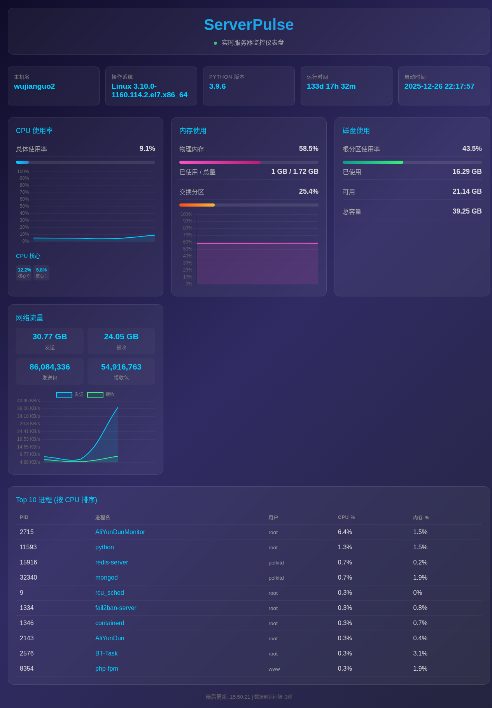

# ServerPulse 服务器监控面板

用 MiMo AI 编程模型从零写成的服务器监控工具，**前端 + 后端共 712 行代码，AI 生成率 100%**。



## 功能特性

- **CPU 实时监控** — 使用率、核心数、温度、型号
- **内存监控** — 总量、已用、可用、使用率
- **磁盘监控** — 各分区使用情况
- **网络流量** — 上传/下载速率
- **进程列表** — CPU 和内存占用 Top 10
- **自动刷新** — 每 3 秒更新数据

## 技术架构

| 组件 | 技术 |
|------|------|
| 后端 | Python Flask + psutil |
| 前端 | 纯 HTML/CSS/JavaScript（无框架） |
| AI 模型 | MiMo v2.5 |

## 快速部署

### 1. 克隆项目

```bash
git clone https://github.com/xinyi-it/serverpulse.git
cd serverpulse
```

### 2. 安装依赖

```bash
python3 -m venv venv
source venv/bin/activate
pip install -r requirements.txt
```

### 3. 启动服务

```bash
python app.py
```

浏览器访问 `http://localhost:5000`

### 4. 生产环境部署（可选）

使用 systemd 管理服务 + Nginx 反向代理：

```bash
# 创建 systemd 服务
sudo tee /etc/systemd/system/serverpulse.service << 'EOF'
[Unit]
Description=ServerPulse Flask App
After=network.target

[Service]
User=root
WorkingDirectory=/opt/serverpulse
ExecStart=/opt/serverpulse/venv/bin/python app.py
Restart=always

[Install]
WantedBy=multi-user.target
EOF

sudo systemctl daemon-reload
sudo systemctl enable serverpulse
sudo systemctl start serverpulse
```

Nginx 配置：

```nginx
server {
    listen 443 ssl;
    server_name pulse.yourdomain.com;

    ssl_certificate /path/to/cert.pem;
    ssl_certificate_key /path/to/key.pem;

    location / {
        proxy_pass http://127.0.0.1:5000;
        proxy_set_header Host $host;
        proxy_set_header X-Real-IP $remote_addr;
    }
}
```

## 项目结构

```
serverpulse/
├── app.py                 # Flask 后端（系统监控 API）
├── templates/
│   └── index.html         # 前端仪表盘
├── requirements.txt       # Python 依赖
├── screenshots/
│   └── dashboard.png      # 界面截图
└── README.md
```

## 关于 MiMo

[MiMo](https://mimo.xiaomi.com) 是小米开源的 AI 编程大模型，本项目是对其实际编程能力的测试。

## License

[MIT](LICENSE)
